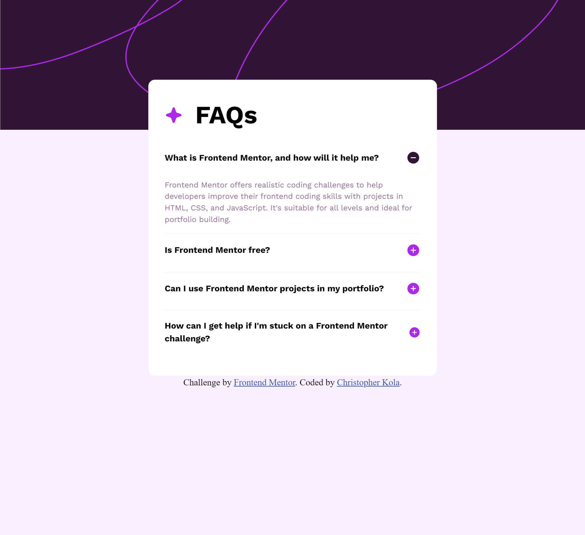
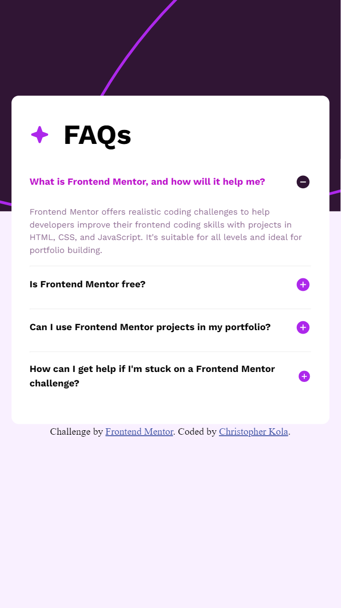

# Frontend Mentor - FAQ accordion solution

This is my solution to the [FAQ accordion challenge on Frontend Mentor](https://www.frontendmentor.io/challenges/faq-accordion-wyfFdeBwBz). Frontend Mentor challenges help you improve your coding skills by building realistic projects.

## Table of contents

- [Overview](#overview)
  - [The challenge](#the-challenge)
  - [Screenshot](#screenshot)
  - [Links](#links)
- [My process](#my-process)
  - [Built with](#built-with)
  - [What I learned](#what-i-learned)
  - [Continued development](#continued-development)
  - [Useful resources](#useful-resources)
- [Author](#author)
- [Acknowledgments](#acknowledgments)

**Note: Delete this note and update the table of contents based on what sections you keep.**

## Overview

### The challenge

Users should be able to:

- Hide/Show the answer to a question when the question is clicked
- Navigate the questions and hide/show answers using keyboard navigation alone
- View the optimal layout for the interface depending on their device's screen size
- See hover and focus states for all interactive elements on the page

### Screenshot

#### Desktop view


#### Mobile view


### Links

- Live Site URL: [Live site URL here](https://ckola99.github.io/faq-accordion/)

## My process

### Built with

- Semantic HTML5 markup
- CSS custom properties
- Flexbox

### What I learned

This project got me to learn about implementing focus using javascript and what the tab index is all about. I also reinforced my knowledge about DOM manipulation using querySelector and other methods.


I'm impressed with the below code because I used methods to manipulate the DOM and understood everything happening in this code.

```js
const answer = header.nextElementSibling;

	// Function to toggle answer visibility
	const toggleAnswer = () => {
		if (answer.style.display === 'block') {
			answer.style.display = 'none';
			header.querySelector('.plus').classList.remove('hidden');
			header.querySelector('.minus').style.display = 'none'
		} else {
			answer.style.display = 'block';
			header.querySelector('.plus').classList.add('hidden');
			header.querySelector('.minus').style.display = 'block'
		}
	};

	// Click event listener for mouse interaction
	header.addEventListener('click', toggleAnswer);

```

The next part of my js code was interesting as I had to learn how to navigate the tabbable elements. This code was interesting and I learned a new pattern to tab elements.


```js
// Keyboard event listener for navigating and toggling answers
	header.addEventListener('keydown', event => {
		if (event.key === 'Enter' || event.key === ' ') {
			// Toggle answer visibility
			toggleAnswer();
		} else if (event.key === 'ArrowUp') {
			// Move to previous question
			const prevIndex = index === 0 ? questionHeaders.length - 1 : index - 1;
			questionHeaders[prevIndex].focus();
		} else if (event.key === 'ArrowDown') {
			// Move to next question
			const nextIndex = index === questionHeaders.length - 1 ? 0 : index + 1;
			questionHeaders[nextIndex].focus();
		}
	});

	// Add tabindex attribute to make question headers focusable
	header.setAttribute('tabindex', '0');
```


### Continued development

I was a bit dependent on chatgpt and would like to get better at writing and visualizing myself through reading the MDN docs and being able to wite and plan better. I also struggle a bit without the exact files of design I would like to be more confident in my design. I also would need to improve my semantic HTML.

### Useful resources

- [Chatgpt](https://www.chatgpt.com) - This helped me solve some small issues and discover what to use like the tab index.
- [MDN](https://developer.mozilla.org/en-US/docs/Web/HTML/Global_attributes/tabindex) - MDN docs are a wealth of knowledge and helped me understand my code a bit better and use the right methods.
- [W3schools](https://www.w3schools.com/howto/howto_js_accordion.asp) - This site helped me see if I was correctly structuring my faq accordion.

## Author

- Frontend Mentor - [@Ckola99](https://www.frontendmentor.io/profile/Ckola99)


## Acknowledgments

No acknowledgements this time.
